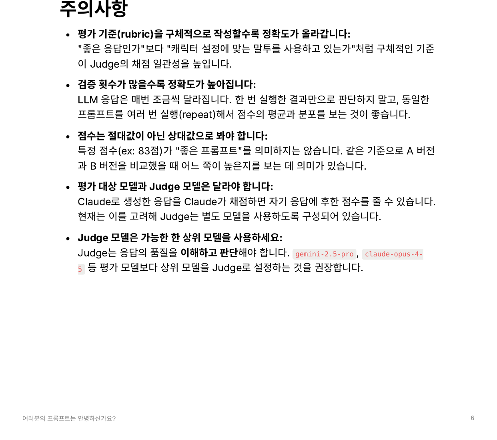

# prompt-eval

## Overview
A small declarative framework for evaluating LLM prompts with deterministic assertions and LLM-as-Judge scoring. The code is extracted from an internal talk titled **"여러분의 프롬프트는 안녕하신가요?"** (*How is your prompt doing?*) and cleaned up for public use.

[한국어 README →](./README.ko.md) · [Talk outline →](./docs/slides.md)

<p align="center">
  
</p>

## Motivation
The way most of us improved prompts was simple: open a browser, paste the prompt, read the response. When cases pile up, we repeat — by hand.

This left the question *"is the new prompt actually better?"* unanswered. The bar is different per person, and even the same person judges differently day to day. So decisions ended up being a gut call. When the model or the prompt changed, there was no safety net to catch regressions.

So I built a way to treat prompts like code: declare what a *good* response looks like, actually call the LLM, and get a score back against pre-defined criteria. For qualitative checks, I borrowed the [LLM-as-a-Judge](https://arxiv.org/pdf/2411.15594) pattern and let a separate LLM do the scoring.

## Design
### Declarative criteria
Different prompts need different checks — JSON schema validation here, a forbidden-word check there, "is the tone appropriate?" elsewhere. Rather than hard-coding the evaluation logic, criteria are declared per case using a Pydantic [discriminated union](./src/prompt_eval/schemas.py) of six kinds.

| Criterion | What it checks |
|---|---|
| `json_field` | Response parses as JSON and a field equals the expected value |
| `range` | A numeric JSON field falls within `[min, max]` |
| `contains` / `not_contains` | The response contains / does not contain given strings |
| `length` | The response length is within bounds |
| `llm_judge` | A separate judge LLM scores 0–100 against a rubric (with optional `repeat` averaging) |

### CI-friendly surface
YAML cases run with a single command (`python -m prompt_eval cases.yaml`), and a failing case exits non-zero. You can drop this straight into GitHub Actions as a prompt regression test.

### Lazy provider instantiation
Three providers are supported (Claude, Gemini, OpenRouter), but only the ones your cases actually use get instantiated. One key is enough to start.

## Examples
### Declaring cases in YAML
```yaml
cases:
  - name: customer_reply_tone
    provider: openrouter
    model: openai/gpt-4o-mini
    prompt: |
      Write a short reply (under 300 chars) to a customer complaining
      about a late delivery. Apologize and offer a 10% coupon.
      Do not use the words "unfortunately" or "policy".
    eval_criteria:
      - type: not_contains
        values: ["unfortunately", "policy"]
      - type: contains
        values: ["10%"]
      - type: length
        max: 300
```

```bash
python -m prompt_eval examples/cases.yaml
```

```
== sentiment_classifier_json_shape ==
  PASSED  score=100.0
  PASS [json_field] field 'sentiment': 기대=negative, 실제=negative
  PASS [range]      field 'confidence': 범위=0.0~1.0, 실제=0.85

3/3 passed
```

### Using it as a library
```python
import asyncio
from prompt_eval import (
    EvalProvider, JsonFieldCriterion, PromptEvalRunRequest, PromptEvalService,
)

async def main():
    service = PromptEvalService()
    response = await service.run(PromptEvalRunRequest(
        prompt='Return ONLY JSON: {"intent": "refund"|"shipping"|"other"}\n\nMessage: "Where is my order?"',
        provider=EvalProvider.OPENROUTER,
        model="openai/gpt-4o-mini",
        eval_criteria=[JsonFieldCriterion(field="intent", equals="shipping")],
    ))
    print(response.passed, response.score)

asyncio.run(main())
```

### Calling it as an HTTP API
A single-file FastAPI server that mirrors the in-house demo:

```bash
.venv/bin/uvicorn examples.api_server:app --reload

curl -X POST http://localhost:8000/eval/run \
  -H 'Content-Type: application/json' \
  -d @examples/sample_request.json
```

## Getting started
```bash
git clone <this repo>
cd how-is-your-prompt
python -m venv .venv && source .venv/bin/activate
pip install -e ".[api,dev]"
cp .env.example .env   # add at least one provider key
python -m prompt_eval examples/cases.yaml
```

The test suite covers the assertion engine and JSON parser without making any network calls, so it runs without API keys.

```bash
.venv/bin/pytest
```

## Stack
### Core
- Python 3.10+ on `asyncio`
- Pydantic v2 - criteria declared as a discriminated union

### Providers
- Anthropic (Claude) / Google (Gemini) / OpenRouter

### Surface
- Click-free CLI (`python -m prompt_eval`) - wires straight into CI
- FastAPI - mirrors the original in-house HTTP demo

## Talk
This project is based on an internal talk titled **"여러분의 프롬프트는 안녕하신가요?"** The original deck used in-house product examples and is not redistributed. A public-friendly outline lives at [`docs/slides.md`](./docs/slides.md).

One of the closing slides — practical tips for writing rubrics and choosing a judge model:

<p align="center">
  
</p>

## References
- **[LLM-as-a-Judge: A Survey (arXiv:2411.15594)](https://arxiv.org/pdf/2411.15594)** - survey of the judge pattern
- **[promptfoo](https://www.promptfoo.dev/)** / **[deepeval](https://github.com/confident-ai/deepeval)** - larger frameworks tackling the same problem

## License
MIT — see [LICENSE](./LICENSE).
